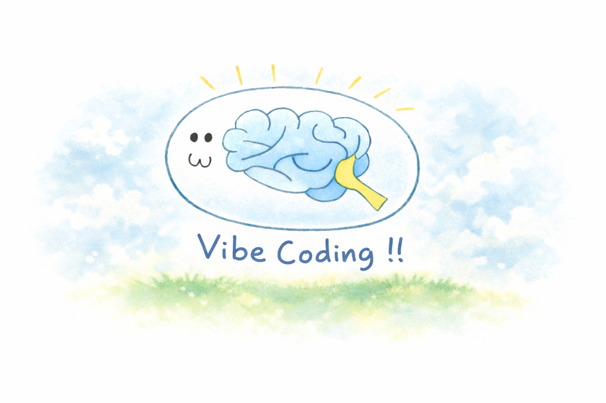

### 初心者のためのＡＩ丸投げプログラミング
## バイブコーディングで学ぶ深層学習
### 渡辺 英治

---

## 本稿について

本稿は、講演会用の資料として急遽書きあげたものです。Claude Opusのバイブコーディングで一貫した長文をどこまで書けるかという実験でもあります。Claude Opusの文章だけだと読了は難しいと判断しましたので、人間１００％の雑談と人間８０％の手描きイラストを加えて完成させました。

HTMLファイルをダウンロードしてローカルで読むこともできますし、Github Pagesでも読むことができます。

[Github Pages / Deep-Learning-with-Vibecoding](https://eijwat.github.io/Deep-Learning-with-Vibecoding/)

とにかく内容の鮮度を保つためにスピード命で仕上げました（３日間）。アップデートは大前提で、比較的軽めの編集作業で公開しています。もし誤字脱字やバグなどありましたら、GitHubリポジトリのIssuesへ書き込んでください。

[Github Issues](https://github.com/eijwat/Deep-Learning-with-Vibecoding/issues)

なお、本稿の主軸は「深層学習とは何？」においてあります。
バイブコーディングはそれを学ぶためんぼ手段としています。

もし「バイブコーディングをもっと進めたい」「やりはじめたけど大きなアプリになってくるとうまくいかない」という段階になってきたら、

[LLMを「使いこなす」ための基礎知識（渡部マサキ）](https://masaki425.github.io/aisystem-notes/)

をお読みください。この段階にくるとコードの中身よりも大事なことができます。
あとハーネスコーディング、エージェントコーディングで調べると山ほど解説動画がでてきますので参照ください。

EW

---

